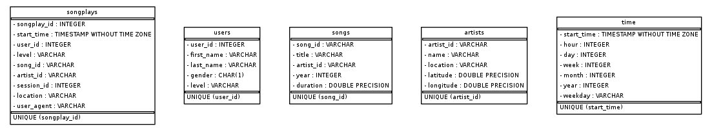

# Project: Data Warehouse

## Summary:

A music streaming startup, Sparkify, has grown their user base and song database and want to move their processes and data onto the cloud. Their data resides in S3, in a directory of JSON logs on user activity on the app, as well as a directory with JSON metadata on the songs in their app.

This project is created to build an ETL pipeline that extracts their data from S3, stages them in Redshift, and transforms data into a set of dimensional tables for their analytics team to continue finding insights into what songs their users are listening to.


## Project Datasets:
* Song data: `s3://udacity-dend/song_data`
* Log data: `s3://udacity-dend/log_data`
* Log data json path: `s3://udacity-dend/log_json_path.json`

### Song Dataset
The first dataset is a subset of real data from the Million Song Dataset. Each file is in JSON format and contains metadata about a song and the artist of that song. The files are partitioned by the first three letters of each song's track ID. For example, here are file paths to two files in this dataset.
```
song_data/A/B/C/TRABCEI128F424C983.json
song_data/A/A/B/TRAABJL12903CDCF1A.json
```
And below is an example of what a single song file, TRAABJL12903CDCF1A.json, looks like.
```json
{"num_songs": 1, "artist_id": "ARJIE2Y1187B994AB7", "artist_latitude": null, "artist_longitude": null, "artist_location": "", "artist_name": "Line Renaud", "song_id": "SOUPIRU12A6D4FA1E1", "title": "Der Kleine Dompfaff", "duration": 152.92036, "year": 0}
```
### Log Dataset
The second dataset consists of log files in JSON format generated by this event simulator based on the songs in the dataset above. These simulate app activity logs from an imaginary music streaming app based on configuration settings.

The log files in the dataset you'll be working with are partitioned by year and month. For example, here are file paths to two files in this dataset.
```
log_data/2018/11/2018-11-12-events.json
log_data/2018/11/2018-11-13-events.json
```
And below is an example of what the data in a log file, 2018-11-12-events.json, looks like.


## How to Run:

1. Launch a redshift cluster and create an IAM role that has read access to S3.
2. Add Redshift database and IAM role info to `dwh.cfg`. Host is the Redshift cluster endpoint.
```
[CLUSTER]
HOST=
DB_NAME=
DB_USER=
DB_PASSWORD=
DB_PORT=

[IAM_ROLE]
ARN=
```
3. Use `run.ipynb` to run the ETL pipeline.
4. Check the table schemas in the Redshift database. You can use Query Editor in the AWS Redshift console for this.
5. Run `SELECT * FROM stl_load_errors` to check any data loading errors in the AWS Redshift Query Editor.
6. Run the analytic queries on your Redshift database to compare your results with the expected results.
7. Delete your Redshift cluster when finished.


## Files:

1. `create_table.py` creates fact and dimension tables for the star schema in Redshift.
2. `etl.py` loads data from S3 into staging tables on Redshift and then processes that data into analytics tables on Redshift.
3. `sql_queries.py` includes SQL statements to transform data, which will be imported into the two other files above.
4. `README.md` provides discussion on the process and decisions for this ETL pipeline.
5. `run.ipynb` includes set of commands to execute.


## Database Schema Design and ETL Pipeline:

A star schema database design is preferred for analyzing data more efficiently.
Star schema simplifies queries and minimizes number of joins for fast analytical performance.
ETL pipeline is built to extract data from S3, stage them in Redshift, and transform data into a set of dimensional tables and a fact table given below.

### Fact Table
1. **songplays** - records in event data associated with song plays i.e. records with page `NextSong`
* songplay_id, start_time, user_id, level, song_id, artist_id, session_id, location, user_agent

### Dimension Tables
2. **users** - users in the app
* user_id, first_name, last_name, gender, level
3. **songs** - songs in music database
* song_id, title, artist_id, year, duration
4. **artists** - artists in music database
* artist_id, name, location, lattitude, longitude
5. **time** - timestamps of records in songplays broken down into specific units
* start_time, hour, day, week, month, year, weekday




Information and sample datasets related to this project are taken from the Udacity Data Engineering Nanodegree Program.
