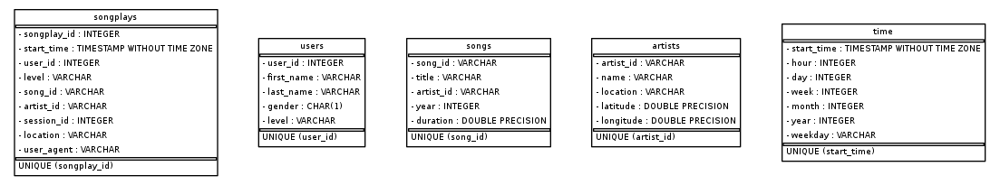

# Project: Data Lake using Spark

## Summary:

A music streaming startup, Sparkify, has grown their user base and song database even more and want to move their data warehouse to a data lake. Their data resides in S3, in a directory of JSON logs on user activity on the app, as well as a directory with JSON metadata on the songs in their app.

This project is created to build an ETL pipeline that extracts their data from S3, processes them using Spark, and loads the data back into S3 as a set of dimensional tables. This will allow their analytics team to continue finding insights in what songs their users are listening to. Also, this Spark process is deployed on a cluster using AWS.

## Project Datasets:
* Song data: `s3://udacity-dend/song_data`
* Log data: `s3://udacity-dend/log_data`

### Song Dataset
The first dataset is a subset of real data from the Million Song Dataset. Each file is in JSON format and contains metadata about a song and the artist of that song. The files are partitioned by the first three letters of each song's track ID. For example, here are filepaths to two files in this dataset.
```
song_data/A/B/C/TRABCEI128F424C983.json
song_data/A/A/B/TRAABJL12903CDCF1A.json
```
And below is an example of what a single song file, TRAABJL12903CDCF1A.json, looks like.
```json
{"num_songs": 1, "artist_id": "ARJIE2Y1187B994AB7", "artist_latitude": null, "artist_longitude": null, "artist_location": "", "artist_name": "Line Renaud", "song_id": "SOUPIRU12A6D4FA1E1", "title": "Der Kleine Dompfaff", "duration": 152.92036, "year": 0}
```
### Log Dataset
The second dataset consists of log files in JSON format generated by this event simulator based on the songs in the dataset above. These simulate app activity logs from a music streaming app based on configuration settings.

The log files in the dataset are partitioned by year and month. For example, here are filepaths to two files in this dataset.
```
log_data/2018/11/2018-11-12-events.json
log_data/2018/11/2018-11-13-events.json
```
And below is an example of what the data in a log file, 2018-11-12-events.json, looks like.


## How to Run:

1. Launch an Amazon EMR cluster that has Hadoop, Spark, JupyterHub, and JupyterEnterpriseGateway enabled in software configuration.
2. Create a Notebook to run Spark on that cluster.
3. Add AWS credentials to `dl.cfg` if running locally as formated below.
```
AWS_ACCESS_KEY_ID=''
AWS_SECRET_ACCESS_KEY=''
```
4. Upload project files to the Jupyter workspace.
5. Update `output_data` variable in the main function if needed.
6. Run `etl.py` to run the ETL pipeline.
7. Check the results in the output S3 bucket.
8. Terminate your EMR cluster when you're finished.


## Files:

1. `etl.py` reads data from S3, processes that data using Spark, and writes them back to S3 in parquet format.
2. `dl.cfg` contains AWS credentials.
3. `README.md` provides discussion on the process and decisions for this ETL pipeline.

## Database Schema Design and ETL Pipeline:

A star schema database design is preferred for analyzing data more efficiently.
Star schema simplifies queries and minimizes number of joins for fast analytical performance.
ETL pipeline is built to extract data from S3, process them using Spark, and load the data back into S3 as a set of dimensional tables.

### Fact Table
1. **songplays** - records in event data associated with song plays i.e. records with page `NextSong`
* songplay_id, start_time, user_id, level, song_id, artist_id, session_id, location, user_agent

### Dimension Tables
2. **users** - users in the app
* user_id, first_name, last_name, gender, level
3. **songs** - songs in music database
* song_id, title, artist_id, year, duration
4. **artists** - artists in music database
* artist_id, name, location, lattitude, longitude
5. **time** - timestamps of records in songplays broken down into specific units
* start_time, hour, day, week, month, year, weekday




Information and sample datasets related to this project are taken from the Udacity Data Engineering Nanodegree Program.
